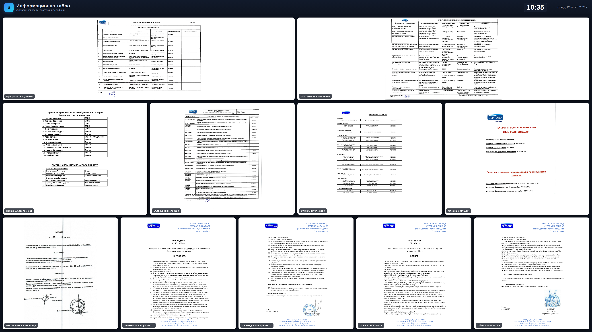

# iiyama-docs-wall

Digital signage dashboard for a **iiyama LH6560UHS-B2AG** (65" 4K UHD landscape panel).
Displays 11 A4 pages (9 portrait + 2 landscape) simultaneously — no slideshow — with a clock, date, and tap-to-zoom fullscreen preview of any document.



## What it shows

Row 1 — landscape:
1. Програма за обучения 2026
2. Програма за почистване 2026

Row 2 — portrait:
3. КУТ — Пожарна безопасност 2026
4. Програма за вътрешни инспекции
5. Служебни телефони 2026
6. Телефони за спешни ситуации

Row 3 — portrait:
7. Заповед 16 — несмесване на отпадъци
8. Заповед 17 — шофьори (BG) стр. 1
9. Заповед 17 — шофьори (BG) стр. 2
10. Order 17 — drivers (EN) p. 1
11. Order 17 — drivers (EN) p. 2

## How it's built

- **Native 3840 × 2160** CSS Grid mosaic (60-column virtual grid → clean 2 · 4 · 5 rows).
- PDFs rendered to PNG at 200 DPI (`pdftoppm -r 200`) and shown as `background-size: contain` inside each tile so every page keeps its true A4 aspect ratio (no distortion).
- Pure HTML/CSS/JS — no framework, no build step, works offline once the tab is open.
- Clock/date localized to `bg-BG`, `Europe/Sofia`.
- Subtle 60-second pixel-drift animation to reduce burn-in on the LED panel.
- Tap/click any tile → fullscreen zoom for reading detail.
- Auto page-reload at 03:30 Sofia daily so redeployments propagate.

## Run on the iiyama panel

The panel's built-in Android launcher can open a URL directly. Two options:

### Option A · Open the hosted URL
Enable GitHub Pages on this repo (`Settings → Pages → Deploy from branch → main / (root)`) and point the panel's browser to:

```
https://<your-user>.github.io/iiyama-docs-wall/web/
```

### Option B · Sideload the APK (kiosk wrapper)
See [`apk/`](apk/) — a minimal WebView kiosk that fullscreens the hosted URL and auto-restarts on boot.
Build with Android Studio or `./gradlew assembleRelease`, then install on the panel via USB / ADB:
```
adb install apk/app-release.apk
```

## Update the documents

1. Replace the PDFs in [`docs/`](docs/).
2. Re-run:
   ```bash
   ./tools/rebuild-pages.sh
   ```
3. `git commit` + `git push`. The panel picks up the change on its next daily refresh (or reload the tab manually).

## Repo layout

```
iiyama-docs-wall/
├── web/            ← the signage web app (deploy this)
│   ├── index.html
│   ├── style.css
│   ├── app.js
│   └── pages/      ← PNG pages, one per PDF page
├── docs/           ← source PDFs + preview screenshot
├── apk/            ← Android WebView kiosk wrapper
├── tools/
│   └── rebuild-pages.sh
└── README.md
```

## License

Internal use. Documents are property of their respective owners.
